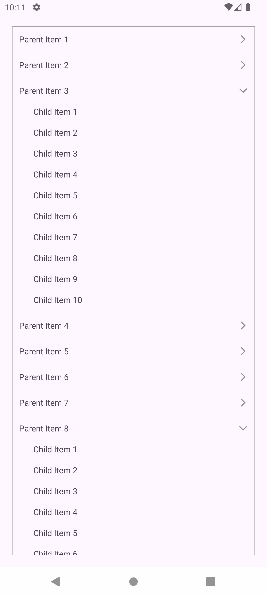

# ExpandableRecyclerView
##### Custom made recycler view to expandable. Use the sample code for expandable list for android with recycler view. [Version: JAVA]

___

## Usage
Current version is not added to the gradle dependencies, So copy the source and use in your project 🙂
___

## Sample Images

##### SAMPLE 1

##### SAMPLE 2

___

## Future Release

* Add adapter interface class
* Add as a gradle dependency
* Custom design class
* Create for Kotlin and Jitpack Compose
___

Copyright © 2024, [Md Sadman](https://github.com/PsykickSam), Released under the [MIT](LICENSE) License.
